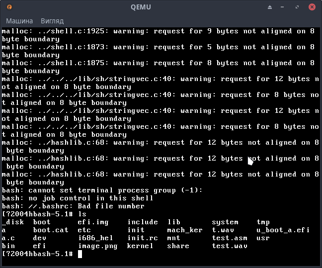

# HelinKern



New implementation of my previous osdev project with main goal to implement full POSIX support and stay as much portable as it can be.
# Project that can help you
The kernel uses source code and/or the design from there projects:
- [SOSO OS](https://github.com/ozkl/soso)
- [ToaruOS](https://github.com/klange/toaruos/tree/toaru-1.x)
- [cuteOS](https://github.com/a-darwish/cuteOS)
- JamesMolloy osdev
- BrokenThorn osdev
- My old osdev project
- At some point [ReactOS](https://github.com/reactos/reactos)
- Great [OSDEV](https://github.com/pdoane/osdev) project
- OSDEV wiki
- GRUB(module loading,AHCI and many many other thinks)
# Build
Firstly install docker and start the docker system, make sure you add your current user to 'docker' group.
Then follow this steps:
```sh
docker build -t helinos_build .
docker run -ti -v $PWD:/work helinos_build
# Inside docker container:
cd work/scripts
bash build-userland.sh download
bash build-userland.sh prepkernel
cd ..
# Copy required for your architecture configuration file.
cp src/arch/x86/config.mk .
make
# At this point the kernel compiled. You can execute make makeiso to produce ISO, or step next instruction to build the userland.
cd scripts/
bash build-userland.sh prephost
bash build-userland.sh build-binutils
bash build-userland.sh build-newlib
bash build-userland.sh build-gcc
# Also you can build ports using this command:
bash build-userland.sh build-ports
cd ..
bash build_sh.sh
# Done! Now you can generate the ISO file
make all makeiso
```

# System Requirements
## For x86:
- Pentium Pro and newer processor.
- 8M of memory to boot base system with IDE drive or 32MB to boot with AHCI drive(need to be fixed in newer releses)
- If the system doesn't boot in graphical mode, then disable UI mode [here](src/arch/x86/boot.s), and set `dontFB` [here](src/arch/x86/arch.c) to `true` and the system must boot in VGA text mode
## For RISC-V 64.
- rv64gc compatable system with OpenSBI firmware.
## For X86_64:
- Minimum 64M of RAM.
- Any x86_64 compatable CPU.

# Userland
The system uses newlib libc port as official libc, there tiny amount of available apps currently because the POSIX support isn't fully complete, but it include: bash,make,coreutils and gcc with bintuils
